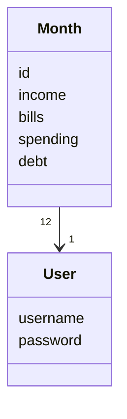
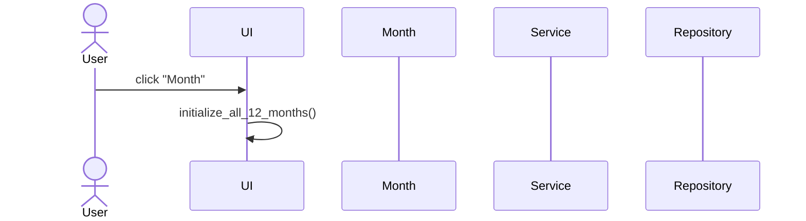

# Arkkitehtuuri

## Rakenne
Ohjelman rakenne:

Tiedostossa ui on sovelluksen käyttöliitymä. Entities -hakemisto sisältää kuukausien ja käyttäjätilien hallintaan liittyvät tiedot.

## Käyttöliittymä
Käyttöliittymä sisältää:
* Käyttäjän kirjautumisen
* Käyttäjän luomisen
* Kuukausikohtaiset budjetointitiedot
* Vuosiyhteenvedon

## Sovelluslogiikka
Sovelluslogiikan muodostavat luokat User ja Month. Jokaiseen käyttäjään liittyy 12 kuukautta.

## Tietojen tallennus
Käyttäjä tallentaa tietonsa CSV-tiedostoon.

## Päätoiminnallisuudet

### Käyttäjän kirjautuminen
Käyttäjä syöttää käyttäjätunnuksensa, salasanansa ja klikkaa "Log in" -nappia.

### Uuden käyttäjän luominen
Käyttäjä syöttää uniikin käyttäjätunnuksen ja salasanan.

### Kuukausibudjetin luominen
Eri kuukausille voi luoda budjetin valitsemalla ikkunan yläreunasta haluttu kuukausi ja syöttämällä luvut tekstikenttiin.

