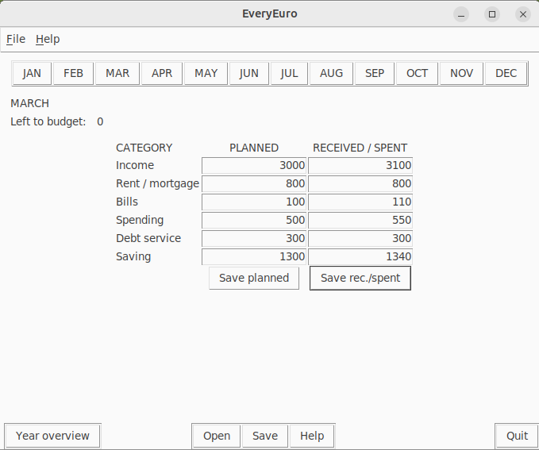

# Arkkitehtuuri

## Rakenne
Ohjelman rakenne:

Tiedostossa ui on sovelluksen käyttöliitymä ja sen aputiedosto. Entities -hakemisto sisältää kuukausien hallintaan liittyvät tiedot. Services -hakemisto sisältää ohjelman logiikan.

## Käyttöliittymä
Käyttöliittymä sisältää:
* Ohjelman pääikkunan, jossa lukujen syöttäminen tapahtuu
* Vaihtaminen kuukaudesta toiseen vaihtaa pääikkunassa näkyvät tiedot
* Help -ikkuna sisältää ohjeen miten ohjelmaa käytetään
* Year overview -ikkuna sisältää vuoden lukujen yhteenvedon ja niihin liittyvät kommentit

## Sovelluslogiikka
Sovelluslogiikan muodostavat luokat User ja Month. Jokaiseen käyttäjään liittyy 12 kuukautta.

Service -moduuli tarjoaa sovellukselle seuraavat toiminnot:
* create_all_months_table()
* get_month_name(month_number)
* get_month_number_and_name(month_name)
* calculate_left_to_budget(income, rent, bills, spending, debt_service, saving)
* calculate_year_figures(table_all_months_receivedspent)
* get_planned_values(table_all_months_planned, month_number)
* update_entry_field_value(entry_field, new_value)
* open_data_from_file()
* save_data_to_file(table_all_months_planned, table_all_months_receivedspent)
* quit_program(root)

## Tietojen tallennus
Käyttäjä tallentaa tietonsa CSV-tiedostoon. Tiedoston voi myöhemmin avata ja tietoja muuttaa.

## Päätoiminnallisuudet

### Kuukausibudjetin luominen
Eri kuukausille voi luoda budjetin valitsemalla ikkunan yläreunasta haluttu kuukausi, syöttämällä luvut Planned -sarakkeen syötekenttiin ja klikkaamalla Save planned -nappia. Toteutuneet tulot ja menot syötetään Received/Spent -sarakkeen kenttiin ja tallennetaan klikkaamalla Save rec./spent.

