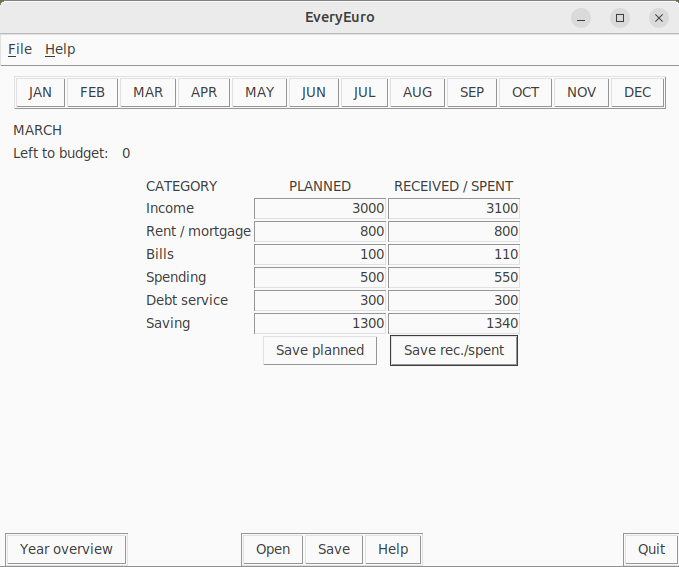
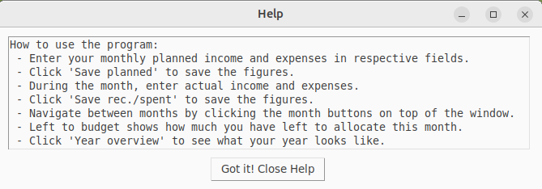
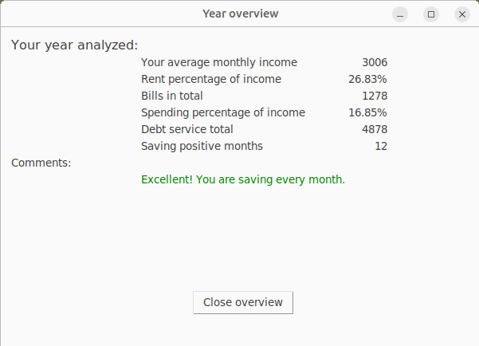

# Käyttöohje

## Ohjelman asentaminen ja käynnistäminen
1. Lataa projektin viimeisin versio koneellesi täältä: [release](https://github.com/aarekr/ot-harjoitustyo/releases/tag/loppupalautus)

2. Asenna riippuvuudet:
```bash
poetry install
```

3. Käynnistä ohjelma:
```bash
poetry run invoke start
```

## Budjettien laatiminen, tallentaminen ja tarkastelu
Ohjelman käynnistyessä käyttäjälle avataan menossa oleva kuukausi ja sen tiedot. Ikkunan yläreunassa ovat kuukaudet, joita klikkaamalla käyttäjä voi navigoida kuukausien välillä. Vasemmassa yläkulmassa on menossa oleva kuukausi ja kuinka paljon budjetoitavaa on vielä jäljellä.

Kuukauden alussa käyttäjä syöttää arvioimansa tulot ja menoerät kuuteen kenttään PLANNED -sarakkeessa. Luvut tallennetaan klikkaamalla Save planned -nappia.

Kuukauden aikana ja/tai lopussa käyttäjä syöttää toteutuneet tulot ja menot kuuteen kenttään RECEIVED / SPENT -sarakkeessa. Luvut tallennetaan klikkaamalla Save rec./spent -nappia.



Help -nappia painamalla käyttäjälle näytetään ohje miten ohjelmaa käytetään.



Ikkunan vasemmassa alareunassa olevaa Year overview -nappia painamalla voi tarkastella miltä vuosi näyttää.



Ikkunan alareunan Open -nappia painamalla käyttäjä voi avata aikaisemmin tallentamansa budjetin.

Ikkunan alareunan Save -nappia painamalla käyttäjä voi tallentaa budjettinsa tiedostoon.

Ohjelman voi sulkea painamalla Quit -nappia.

Ikkunan yläreunan valikosta löytyvät toiminnot Open, Save, Quit ja Help.
