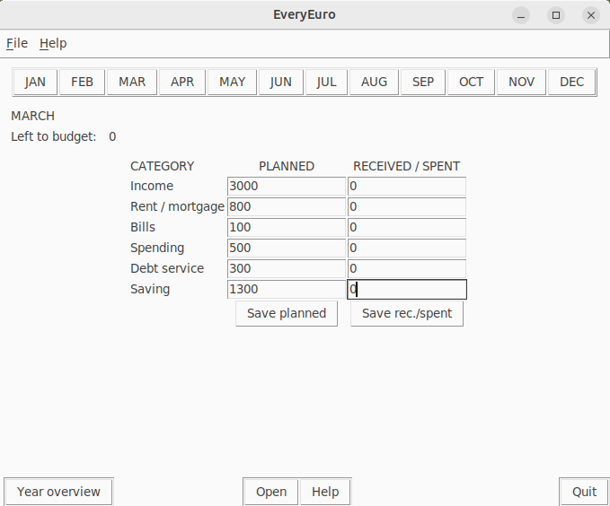

# Käyttöohje

Lataa projektin viimeisin versio koneellesi.

## Ohjelman käynnistäminen
* Tulossa

## Budjettien laatiminen, tallentaminen ja tarkastelu
Ohjelman käynnistyessä käyttäjälle avataan menossa oleva kuukausi ja sen tiedot. Ikkunan yläreunassa on kuukaudet, joita klikkaamalla käyttäjä voi navigoida kuukausien välillä. Vasemmassa yläkulmassa on menossa oleva kuukausi ja kuinka paljon budjetoitavaa on vielä jäljellä.
Kuukauden alussa käyttäjä syöttää arvioimansa tulot ja menoerät kuuteen kenttään PLANNED -sarakkeessa. Luvut tallennetaan klikkaamalla Save planned -nappia. Kuukauden lopussa käyttäjä syöttää toteutuneet tulot ja menot kuuteen kenttään RECEIVED / SPENT -sarakkeessa. Luvut tallennetaan klikkaamalla Save rec./spent -nappia.
Ikkunan vasemmassa alareunassa olevaa Year overview -nappia painamalla käyttäjälle näytetään koko vuoden yhteenveto.
Ikkunan alareunan Open -nappia painamalla käyttäjä voi avata aikaisemmin tallentamansa tiedot.
Help -nappia painamalla käyttäjälle näytetään ohje miten ohjelmaa käytetään.
Ohjelman voi sulkea painamalla Quit -nappia.

