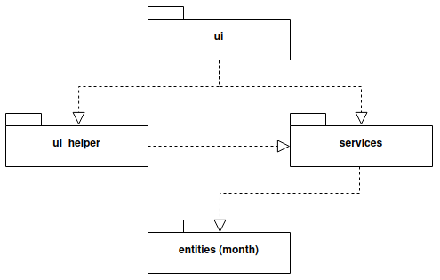

# Testausdokumentti

## Yksikkötestaus
* Testauksessa on käytetty Pythonin unittest -työkalua. Testejä on yhteensä 33 kpl.

## Mitä testattu ja miten

#### Month -luokka (TestMonth)
* Ohjelman käynnistyessä kuukausi muodostuu ja nimi tallentuu oikein
* Taulukkoon tallennetun kuukauden nimi on oikein
* Kuukauden tulot asetetaan oikein ja ne voi hakea
* Kuukauden vuokra/asuntolaina asetetaan oikein ja tiedon voi hakea
* Kuukauden laskut asetetaan oikein ja ne voi hakea
* Kuukauden kulutus asetetaan oikein ja sen voi hakea
* Kuukauden velanhoito asetetaan oikein ja sen voi hakea
* Kuukauden säästäminen asetetaan oikein ja sen voi hakea
* Kuukauden tuloja voi muuttaa ja muutos tallentuu
* Kuukauden vuokraa/asuntolainaa voi muuttaa ja muutos tallentuu
* Kuukauden laskuja voi muuttaa ja muutos tallentuu
* Kuukauden kulutusta voi muuttaa ja muutos tallentuu
* Kuukauden velanhoitoa voi muuttaa ja muutos tallentuu
* Kuukauden säästämistä voi muuttaa ja muutos tallentuu

#### Sovelluslogiikka (TestService)
* Kuukauden nimen haku numeron perusteella antaa oikean kuukauden
* Kuukauden numeron haku nimen perusteella antaa oikean numeron
* Budjetoitavaa jäljellä-toiminto laskee tulojen ja menojen erotuksen oikein
* Tiedoston avaaminen hakee tallennetut tiedot oikein ja tallentaa taulukoihin
* Budjetin tallentaminen tiedostoon toimii oikein
* Erien summien ja prosenttilukujen tarkistus käyttämällä valmista tiedostoa
* Ohjelman lopettamisen vahvistava toiminto on olemassa

#### Syötekenttien validointi (TestEntryFields)
* Planned ja Received/Spent income -kentät hyväksyvät vain kokonaisluvut ja antavat muissa tapauksissa virheilmoituksen
* Planned ja Received/Spent rent/mortgage -kentät hyväksyvät vain kokonaisluvut ja antavat muissa tapauksissa virheilmoituksen
* Planned ja Received/Spent bills -kentät hyväksyvät vain kokonaisluvut ja antavat muissa tapauksissa virheilmoituksen
* Planned ja Received/Spent spending -kentät hyväksyvät vain kokonaisluvut ja antavat muissa tapauksissa virheilmoituksen
* Planned ja Received/Spent debt service -kentät hyväksyvät vain kokonaisluvut ja antavat muissa tapauksissa virheilmoituksen
* Planned ja Received/Spent saving -kentät hyväksyvät vain kokonaisluvut ja antavat muissa tapauksissa virheilmoituksen

## Testauskattavuus
Testauskattavuus ilman käyttöliittymää on 85%.

## Sovellukseen jääneet ongelmat
* Budjetin syötekenttien tallentaminen hoidetaan käyttöliittymässä. Vaikka kentät ja niiden sisältö näkyvät ohjelman pääikkunassa, validointi, tallentaminen ja esittäminen olisi parempi siirtää käyttöliittymästä ulos.
* Planned ja received/spent -luvut on jaettu kahteen eri taulukkoon, koska esim. year overview -toiminto tarvitsee vain toista taulkoista. Lukujen käsittely yhdessä taulukossa saattaa olla järkevämpää ohjelman laajentuessa, esim. jos luodaan kolmas sarake difference, joka ilmoittaa suunniteltujen ja toteutuneiden erien erot.
