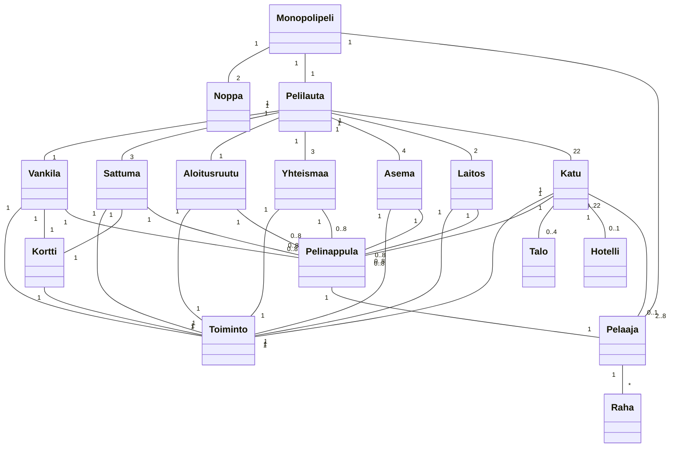

## Monopoli

```mermaid
 classDiagram
     Monopolipeli "1" -- "2" Noppa
     Monopolipeli "1" -- "1" Pelilauta

     Pelilauta "1" -- "1" Vankila
     Pelilauta "1" -- "3" Sattuma
     Pelilauta "1" -- "1" Aloitusruutu
     Pelilauta "1" -- "3" Yhteismaa
     Pelilauta "1" -- "4" Asema
     Pelilauta "1" -- "2" Laitos
     Pelilauta "1" -- "22" Katu

     Aloitusruutu "1" -- "1" Toiminto
     Vankila "1" -- "1" Toiminto
     Sattuma "1" -- "1" Toiminto
     Yhteismaa "1" -- "1" Toiminto
     Asema "1" -- "1" Toiminto
     Laitos "1" -- "1" Toiminto
     Katu "1" -- "1" Toiminto

     Vankila "1" -- "1" Kortti
     Sattuma "1" -- "1" Kortti
     Kortti "1" -- "1" Toiminto

     Aloitusruutu "1" -- "0..8" Pelinappula
     Vankila "1" -- "0..8" Pelinappula
     Sattuma "1" -- "0..8" Pelinappula
     Yhteismaa "1" -- "0..8" Pelinappula
     Asema "1" -- "0..8" Pelinappula
     Laitos "1" -- "0..8" Pelinappula

     Katu "1" -- "0..8" Pelinappula
     Katu "1" -- "0..4" Talo
     Katu "1" -- "0..1" Hotelli
     Katu "0..22" -- "0..1" Pelaaja

     Pelinappula "1" -- "1" Pelaaja
     Monopolipeli "1" -- "2..8" Pelaaja
     Pelaaja "1" -- "*" Raha
```
