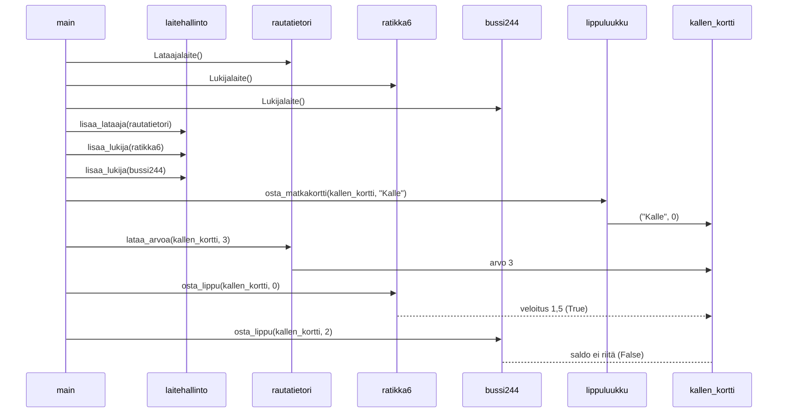

# HSL sekvenssikaavio

```mermaid
 sequenceDiagram
      participant main
      participant laitehallinto
      participant rautatietori
      participant ratikka6
      participant bussi244
      participant lippuluukku
      participant kallen_kortti

      main->>rautatietori: Lataajalaite()
      main->>ratikka6: Lukijalaite()
      main->>bussi244: Lukijalaite()
      main->>laitehallinto: lisaa_lataaja(rautatietori)
      main->>laitehallinto: lisaa_lukija(ratikka6)
      main->>laitehallinto: lisaa_lukija(bussi244)
      main->>lippuluukku: osta_matkakortti(kallen_kortti, "Kalle")
      lippuluukku->>kallen_kortti: ("Kalle", 0)
      main->>rautatietori: lataa_arvoa(kallen_kortti, 3)
      rautatietori->>kallen_kortti: arvo 3
      main->>ratikka6: osta_lippu(kallen_kortti, 0)
      ratikka6-->>kallen_kortti: veloitus 1,5 (True)
      main->>bussi244: osta_lippu(kallen_kortti, 2)
      bussi244-->kallen_kortti: saldo ei riitä (False)
```
